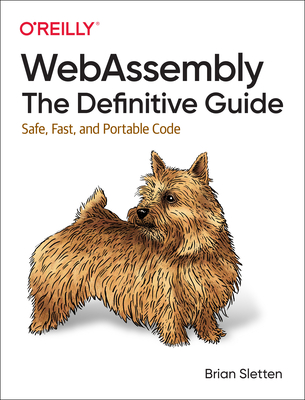

# WebAssembly. The Definitive Guide

This is a walkthrough of the O'Reilly book by Brian Sletten



## Required tools

In order to run examples from this repository you will need a few tools installed on your machine. You may install them manually
or, prepare a `nix-shell` environment, as, for example, I did [here](https://github.com/vasigorc/bash-utils/blob/main/nix/compiled-module.nix).

### Example of using `nix-shell` environments

Note, that this requires you to have `nix-shell` [installed](https://nixos.org/download/) on your laptop.

In my case, I've downloaded this [Git repository](https://github.com/vasigorc/bash-utils), and then from the root of this repostiory I ran:

```shell
nix-shell ~/repos/bash-utils/nix/compiled.nix
unpacking 'https://github.com/NixOS/nixpkgs/archive/e24b4c09e963677b1beea49d411cd315a024ad3a.tar.gz' into the Git cache...
info: using existing install for 'stable-x86_64-unknown-linux-gnu'
info: default toolchain set to 'stable-x86_64-unknown-linux-gnu'

  stable-x86_64-unknown-linux-gnu unchanged - rustc 1.79.0 (129f3b996 2024-06-10)
[nix-shell:~/repos/wasm_definitive_guide]$
```

### Examples for manual tooling instalation

#### wabt

Follow this [link](https://github.com/WebAssembly/wabt?tab=readme-ov-file#installing-prebuilt-binaries) to install
pre-build binaries. E.g. for Fedora I used:

```shell
sudo dnf install wabt
```

#### wasm3

I actually installed it from source.

##### For Fedora

```shell
# install missing dependencies
sudo dnf install git cmake gcc-c++ make

# clone the sources
# and build in a `build` directory
git clone https://github.com/wasm3/wasm3.git
cd wasm3
mkdir build
cd build
cmake ..

# install system-wide
sudo make install

# test installation
➜  wasm_definitive_guide git:(main) wasm3 --version                               
Wasm3 v0.5.1 on x86_64
Build: Dec 27 2024 15:34:31, GCC 13.3.1 20240913 (Red Hat 13.3.1-3)
```

##### For Ubuntu / POP!_OS


```shell
# install missing dependencies
sudo apt install git cmake g++ make

# clone the sources
# and build in a `build` directory
git clone https://github.com/wasm3/wasm3.git
cd wasm3
mkdir build
cd build
cmake ..

# install system-wide
sudo make install

# test installation
➜  wasm_definitive_guide git:(main) wasm3 --version                               
...
```

#### LLVM

LLVM - is a compiler toolkit that serves as the basis of Rust, Swift, Julia and many more.

Installation instructions for LLVM can be found [here](https://apt.llvm.org/).

This is how one would install LLVM on most of UNIX bases systems:

```shell
bash -c "$(wget -O - https://apt.llvm.org/llvm.sh)"
```

It didn't work for me on Fedora though, I actually had to follow slightly modified steps from LLVM's [GetStarted page](https://clang.llvm.org/get_started.html):

```shell
git clone --depth=1 https://github.com/llvm/llvm-project.git
cd llvm-project
mkdir build
cd build
cmake -DLLVM_ENABLE_PROJECTS=clang -DCMAKE_BUILD_TYPE=Release -G "Unix Makefiles" ../llvm
sudo make install
```

I also found myself needing to do this to install `wasm-lld`:

```shell
sudo dnf install lld clang llvm
```

This second option literally laster hours before completing, in the end you should have `clang` installed though:

```shell
which clang
/usr/local/bin/clang
```

Lastly confirm that the installed LLVM version supports WebAssembly:

```shell
llc --version | grep wasm
    wasm32      - WebAssembly 32-bit
    wasm64      - WebAssembly 64-bit
```

#### Emscripten 

The [recommended approach](https://emscripten.org/docs/getting_started/downloads.html#installation-instructions-using-the-emsdk-recommended)
is to, again, install it from sources:

```shell
# clone the repository
git clone https://github.com/emscripten-core/emsdk.git
cd emsdk
# install the sdk
./emsdk install latest
# make Emscripten available to the current shell session
source ./emsdk_env.sh
```

To facilitate working with `emcc` from other directories, consider adding last line to `~/.zsrhc` or `~/.bashrc`:

```shell
export EMSDK_QUIET=1
source /home/vgorcinschi/repos/emsdk/emsdk_env.sh > /dev/null 2>&1
```

## WAT - WASM files

In most cases when a particular chapter includes a `.wat` file there will
be a corresponding `.wasm` file. Note, that you could have generated it yourself, e.g.:

```shell
cd chapter_03/
wat2wasm hellolog.wat
```

In order to analyze the binary `.wasm` file, use `wasm-objdump` tool, e.g.:

```shell
➜  chapter_03 git:(main) ✗ wasm-objdump -x hellolog.wasm

hellolog.wasm:  file format wasm 0x1

Section Details:

Type[3]:
 - type[0] (i32) -> nil
 - type[1] (i32, i32) -> i32
 - type[2] (i32, i32) -> nil
Import[1]:
 - func[0] sig=0 <imports.log_func> <- imports.log_func
Function[2]:
 - func[1] sig=1 <how_old>
 - func[2] sig=2 <log_how_old>
Export[2]:
 - func[1] <how_old> -> "how_old"
 - func[2] <log_how_old> -> "log_how_old"
Code[2]:
 - func[1] size=7 <how_old>
 - func[2] size=10 <log_how_old>
 ```
