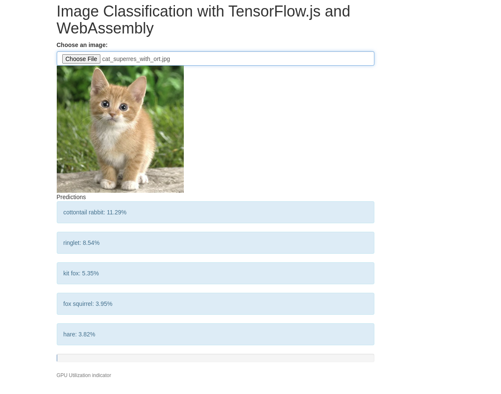

# Chapter 9. Applied WebAssembly: TensorFlow.js

This is the first of the _Applied WebAssembly_ chapters, where potential use cases for WebAssembly are highlighted.

This chapter touches upon scenarios of leveraging Machine Learning directly in the browser, potentially, as we will
try to demonstrate, even relying on the underlying platform's acceleration (GPUs in our case).

Some key ideas from the chapter's theory is that as computer hardware gets more and more sophisticated, it takes
time and power to compute things. _A big part of a successful IT strategy moving forward is going to be about minimizing
time costs, power costs, and latency costs...In order to process data in reasonable amounts of time, we need acccess to
hardware acceleration._

## TensorFlow.js

_The design of the TensorFlow.js framework is elegant and results in clean APIs that work across a wide range of devices.
Rather than limiting the implementation to what is available everywhere, the designers chose to create a pluggable backend
to cover the wildest number of systems._

_There is no direct support for accessing GPUs from JavaScript, but there is via WebGL._

_The applications written against (Layers API (inspired from Keras) or Ops API) will be portable across all of the environments
covered by the backends. That includes in the browser, out of the browser, with hardware acceleration and without._

The list of supported backends:

- CPU JavaScript backend
- WebGL JavaScript backend
- CPU (+AVX) native backend
- GPU native backend
- TPU native backend
- WASM backend

Hence, we see _a strategy for isolating the bits that change and taking advantage of the hardware options available to us._

## Demo Project: TensorFlow.js with WebAssembly Image Classification

We created a demo that combines TensorFlow.js with WebAssembly to perform image Classification.
The demo uses the MobileNet model to classify images, and WebAssembly for image preprocessing.

<div class="warning">
  <strong>Warning: </strong> The performance of this app is notoriously poor. In fact,
  just without WebAssembly preprocessing the prediction score will go up by ~40%, but the
  point of this exercise is not to present a well-performing image recognition model, but
  simply how WebAssembly can play together with TensorFlow.js
</div>

### Setup and Running the Demo

1. Please create a symlink to common folder as in the previos chapters so that the example works:

   ```shell
   # supposing you are in chapter_09 folder already
   ln -s ../common common
   ```

2. Compile the WebAssembly code with Emscripten:

   ```shell
   make
   ```

Note: the compilation requires at least C++11 support. This is specified in the [Makefile](./Makefile)

3. Start a web server to serve the files:

   ```shell
   python3 -m http.server 10003
   ```

4. Open your browser and navigate to: `http://localhost:10003/`
5. Select an image from the images folder inside chapter_09



### What's happening

When you run the demo:

1. **WebGL** detection: The application attempts to use the WebGL backend for
   TensorFlow.js, which you can verify in the console:

   ```javascript
   Using backend: webgl
   WebGL Vendor WebKit
   WebGL Renderer WebKit WebGL
   ```

2. **Model Loading**: The MobileNet model is loaded from TensorFlow.js' model
   repository

3. **Image Processing**: When you select an image, the WebAssembly module
   preprocesses it before it's passed to the TensorFlow.js model
4. **Inference**: The model makes predictions about the content of the image,
   which are displayed on the page

   ```javascript
   Inference time: 189.80ms
   ```

5. **GPU Utilization**: A progress bar shows GPU utilization during inference

### Console Output

The browser console provides helpful information:

- Confirmation of the WebGL backend being used
- Model loading status
- Inference time measurements'
- Any errors that might occur during the process

### Observations

- The WebGL backend is used for acceleration, though it may be using your
  integrated GPU rather than a dedicated one
- Inference times for a small model like MobileNet can be relatively fast even
  without
