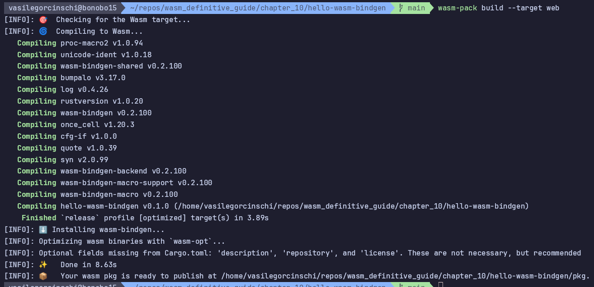
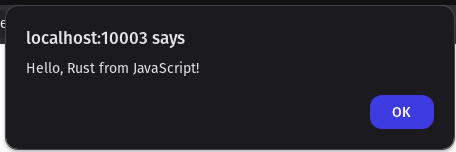
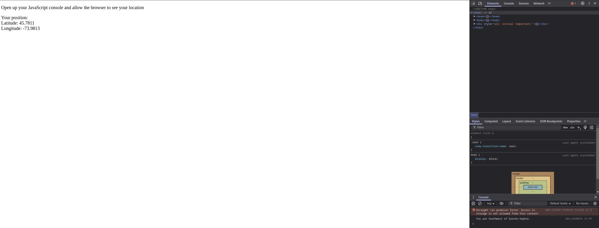

# Chapter 10. Rust

## Introduction to Rust

I've passed the examples from this section due to my familiarity with Rust, but
I am just keeping this one phrase from the author:

> The combination of Rust's speed, safety and its being built on LLVM make
> it a great language to pair with WebAssembly.

## Rust and WebAssembly

First thing that we will need is Rust's WebAssembly backend. To confirm that this is the
case run the following:

```shell
 ✘ vasilegorcinschi@bonobo15  ~/repos/wasm_definitive_guide   main  rustup target list | grep wasm
wasm32-unknown-emscripten
wasm32-unknown-unknown
wasm32-wasi
wasm32-wasip1
wasm32-wasip1-threads

```

Else, please refer to the installation steps using Nix from the [main README](../README.md) or refer
to the book's appendix.

> Rust backends are labeled as triples, indicating the instruction set architecture (ISA),
> the vendor, and the operating system.

WebAssembly has `unknown` because it is code portable across architectures (e.g. x86_64, aarch64, riscv64, or arm7).

First a straitghtforward example is given of compiling and running a rust file is given:

```shell
 ✘ vasilegorcinschi@bonobo15  ~/repos/wasm_definitive_guide/chapter_10   main  rustc add.rs
 vasilegorcinschi@bonobo15  ~/repos/wasm_definitive_guide/chapter_10   main  ./add
2 + 3: 5
```

We can run the same code with `wasmer` by compiling it for `wasm32-unknown-unknown` target like such:

```shell
vasilegorcinschi@bonobo15  ~/repos/wasm_definitive_guide/chapter_10   main ±  rustc -A dead_code --target wasm32-unknown-unknown -O --crate-type=cdylib add.rs -o add.wasm
vasilegorcinschi@bonobo15  ~/repos/wasm_definitive_guide/chapter_10   main ±  wasmer run add.wasm -i add 2 3
5
```

We may run the same file in the browser similary how we did with the C code in the previous chapters:

```shell
ln -s ../common common
python3 -m htttp.server 10003
```


## wasm-bindgen

Cargo project was created like so (note `vcs=none`):

```shell
vasilegorcinschi@bonobo15  ~/repos/wasm_definitive_guide/chapter_10   main ±  cargo new --lib hello-wasm-bindgen --vcs=none
    Creating library `hello-wasm-bindgen` package
note: see more `Cargo.toml` keys and their definitions at https://doc.rust-lang.org/cargo/reference/manifest.html
```

### Why is the `crate-type` set to `cdylib`?

1. **C-compatible Dynamic Library:**
   - `cdylib` stands for "C-compatible dynamic library"
   - It instructs the Rust compiler to produce a binary that can be loaded by _non-Rust_ programs

2. **WebAssembly-specific reasons:**
   - When targeting WebAssembly with `wasm-bindgen`, the compiled output needs to be a standalone module that can be loaded by JavaScript
   - It produces a minimal binary by excluding Rust-specific metadata that's not needed for interoperability
   - It only exports symbols that are explicitly marked for export (like functions tagged with `#[wasm_bindgen]`)

3. **Differences from other crate types:**
   - Without `cdylib`, Rust would default to producing a `rlib` (Rust library), which contains Rust-specific metadata not needed for WebAssembly
   - Other options like `staticlib` or `dylib` are designed for different use cases and would include unnecessary elements

## Why it's necessary for wasm-bindgen

`wasm-bindgen` works by generating JavaScript glue code that interfaces with the 
compiled WebAssembly module. The toolchain expects Rust code to be compiled
as a self-contained library that exposes specific functions, which is exactly what
the `cdylib` format provides.

Without this setting, the `wasm-bindgen` tools would not be able to properly interact
with the compiled Rust code, resulting in errors during the build process or runtime
issues when trying to use your WebAssembly module from JavaScript.

### hello-wasm-bindgen

This is a sample application that demonstrates how to use `wasm-bindgen` to create
a WebAssembly module from Rust code. It relies on `wasm-pack` to build the module
which is ready to be used in a web browser:



The output includes JavaScript, TypeScript, TypeScript definitions, and `package.json` files:

```shell
✘ vasilegorcinschi@bonobo15  ~/repos/wasm_definitive_guide/chapter_10   main ±  ls -halF hello-wasm-bindgen/pkg
total 52K
drwxr-xr-x 2 vasilegorcinschi vasilegorcinschi 4.0K Mar 10 18:37 ./
drwxrwxr-x 5 vasilegorcinschi vasilegorcinschi 4.0K Mar 10 18:37 ../
-rw-r--r-- 1 vasilegorcinschi vasilegorcinschi    1 Mar 10 18:37 .gitignore
-rw-r--r-- 1 vasilegorcinschi vasilegorcinschi 1.4K Mar 10 18:37 hello_wasm_bindgen.d.ts
-rw-r--r-- 1 vasilegorcinschi vasilegorcinschi 5.8K Mar 10 18:37 hello_wasm_bindgen.js
-rw-r--r-- 1 vasilegorcinschi vasilegorcinschi  17K Mar 10 18:37 hello_wasm_bindgen_bg.wasm
-rw-r--r-- 1 vasilegorcinschi vasilegorcinschi  316 Mar 10 18:37 hello_wasm_bindgen_bg.wasm.d.ts
-rw-r--r-- 1 vasilegorcinschi vasilegorcinschi  303 Mar 10 18:37 package.json
```

The generated WebAssembly module includes a `Memory` instance, as well as memory allocation functions:

```shell
vasilegorcinschi@bonobo15  ~/repos/wasm_definitive_guide/chapter_10   main ±  wasm-objdump -x hello-wasm-bindgen/pkg/hello_wasm_bindgen_bg.wasm | grep -A 4 Export
Export[4]:
- memory[0] -> "memory"
- func[12] <say_hello> -> "say_hello"
- func[22] <__wbindgen_malloc> -> "__wbindgen_malloc"
- func[26] <__wbindgen_realloc> -> "__wbindgen_realloc"
```

What this mini-app does is that it has a Rust module import JavaScript's `alert()`
function and uses it to display a message when the `say_hello` function is called:



### geo-example

One last example will try to use a more involved Rust logic to calculate a user's relative
position to where I lived at the time of writing this documentation. The project is built
in the same manner as the previous examples. Running it, you may see that native code
generated from Rust is called from JavaScript:


